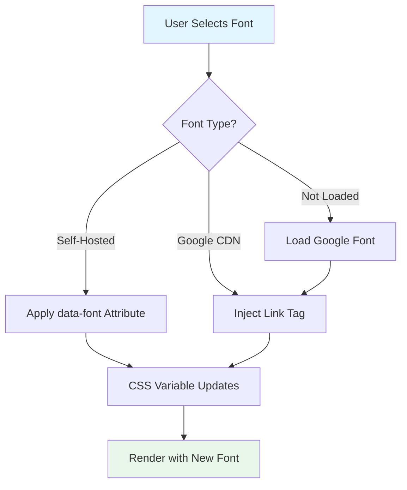

# Google Fonts Integration Options for Vanduo Framework

## Current Font System Overview

Vanduo currently uses a **self-hosted font system** with the following architecture:

- **Font files**: Stored in `/fonts/` directory (woff2 format)
- **Font definitions**: [`@font-face`](css/core/fonts.css:12) rules in [`css/core/fonts.css`](css/core/fonts.css)
- **CSS variables**: Font families controlled via CSS custom properties in [`css/core/typography.css`](css/core/typography.css:8)
- **Font switching**: Via [`data-font`](css/core/typography.css:14) attribute on `<html>` element
- **JS component**: [`FontSwitcher`](js/components/font-switcher.js:9) manages selection and persistence

### Currently Available Fonts
| Font | ID | Weights | Type |
|------|-----|---------|------|
| System Default | `system` | - | System fonts |
| Inter | `inter` | 400, 500, 600, 700 | Sans-serif |
| Source Sans 3 | `source-sans` | 400, 600, 700 | Sans-serif |
| Fira Sans | `fira-sans` | 400, 500, 700 | Sans-serif |
| IBM Plex Sans | `ibm-plex` | 400, 500, 700 | Sans-serif |
| JetBrains Mono | `jetbrains-mono` | 400, 700 | Monospace |

---

## Google Fonts Integration Options

### Option 1: CDN Link Method (Simplest)

Add Google Fonts via `<link>` tag in HTML head. Best for quick prototyping.

**Pros:**
- Zero setup, just add a link
- Automatic updates
- Google's CDN is fast and cached

**Cons:**
- External dependency (privacy concerns)
- No offline capability
- Extra HTTP request to third-party

**Example Usage:**
```html
<!-- In your HTML <head> -->
<link rel="preconnect" href="https://fonts.googleapis.com">
<link rel="preconnect" href="https://fonts.gstatic.com" crossorigin>
<link href="https://fonts.googleapis.com/css2?family=Ubuntu:wght@400;500;700&display=swap" rel="stylesheet">
```

**CSS Integration with Vanduo:**
```css
/* Add to your custom styles or typography.css */
[data-font="ubuntu"] {
  --font-family-sans: 'Ubuntu', -apple-system, BlinkMacSystemFont, sans-serif;
}
```

**JavaScript Registration:**
```javascript
// Add to FontSwitcher fonts config
fonts: {
  // ... existing fonts
  'ubuntu': {
    name: 'Ubuntu',
    family: "'Ubuntu', sans-serif",
    googleFont: true,
    url: 'https://fonts.googleapis.com/css2?family=Ubuntu:wght@400;500;700&display=swap'
  }
}
```

---

### Option 2: @import Method (CSS-Only)

Import Google Fonts directly in CSS using `@import`.

**Pros:**
- Keeps fonts in CSS layer
- No HTML modifications needed
- Works with Vanduo's modular CSS approach

**Cons:**
- Still external dependency
- Slightly slower than `<link>` (renders blocking)
- No offline capability

**Example:**
```css
/* At the TOP of fonts.css or custom CSS file */
@import url('https://fonts.googleapis.com/css2?family=Ubuntu:wght@400;500;700&display=swap');

[data-font="ubuntu"] {
  --font-family-sans: 'Ubuntu', -apple-system, BlinkMacSystemFont, sans-serif;
}
```

---

### Option 3: Self-Host Google Fonts (Recommended for Production)

Download Google Fonts and self-host them, matching Vanduo's current approach.

**Pros:**
- Full offline capability
- No external dependencies
- Better privacy (no Google tracking)
- Full control over caching
- Consistent with Vanduo philosophy

**Cons:**
- Manual font file management
- Larger repository size
- Need to download font files

**Implementation Steps:**

1. **Download fonts** using tools like:
   - [google-webfonts-helper](https://gwfh.mranftl.com/)
   - [fontsource.org](https://fontsource.org/)
   - Manual download from Google Fonts

2. **Directory structure:**
   ```
   fonts/
   ├── ubuntu/
   │   ├── ubuntu-regular.woff2
   │   ├── ubuntu-medium.woff2
   │   └── ubuntu-bold.woff2
   └── ...
   ```

3. **Add @font-face rules:**
   ```css
   /* In css/core/fonts.css */
   @font-face {
     font-family: 'Ubuntu';
     src: url('../../fonts/ubuntu/ubuntu-regular.woff2') format('woff2');
     font-weight: 400;
     font-style: normal;
     font-display: swap;
   }
   /* ... more weights ... */
   ```

4. **Register in typography.css:**
   ```css
   [data-font="ubuntu"] {
     --font-family-sans: 'Ubuntu', -apple-system, BlinkMacSystemFont, sans-serif;
   }
   ```

---

### Option 4: JavaScript Dynamic Loader (Advanced)

Load Google Fonts dynamically via JavaScript/Web Font Loader.

**Pros:**
- Load fonts on-demand
- Can load multiple fonts dynamically
- Better control over loading events

**Cons:**
- More complex implementation
- JavaScript dependency
- FOUT/FOIT handling needed

**Example Implementation:**
```javascript
// Enhanced FontSwitcher with Google Fonts support
loadGoogleFont: function(fontName, weights = '400;500;700') {
  const link = document.createElement('link');
  link.rel = 'stylesheet';
  link.href = `https://fonts.googleapis.com/css2?family=${fontName}:wght@${weights}&display=swap`;
  document.head.appendChild(link);
}
```

---

### Option 5: Build-Time Integration (Developer Tooling)

Create a build script to download and bundle Google Fonts automatically.

**Pros:**
- Automates self-hosting
- Version controlled font files
- CI/CD friendly

**Cons:**
- Requires build step
- More tooling complexity

**Tool Options:**
- `google-fonts-helper` npm package
- Custom Node.js script
- GitHub Actions workflow

---

## Recommended Approach for Vanduo

Based on Vanduo's philosophy of **zero dependencies** and **pure HTML/CSS/JS**, the **recommended approach is Option 3 (Self-Hosting)** with a **curated collection** of pre-selected Google Fonts.

### Curated Google Fonts Collection

The framework will include these self-hosted Google Fonts (in addition to existing fonts):

| Font | ID | Style | Use Case |
|------|-----|-------|----------|
| **Ubuntu** | `ubuntu` | Humanist sans-serif | Friendly, approachable UI |
| **Open Sans** | `open-sans` | Neutral sans-serif | Highly readable, professional |
| **Rubik** | `rubik` | Geometric sans-serif | Modern, distinctive |
| **Titillium Web** | `titillium-web` | Sans-serif | Technical, elegant |

> **Note:** Google Sans is proprietary and not available in Google Fonts. Alternatives: use **Roboto** (similar metrics) or **Product Sans** (if licensed).

### Implementation Plan

#### Phase 1: Download & Host Fonts
1. Download font files for each curated font (weights: 400, 500, 700)
2. Place in `/fonts/{font-name}/` directories
3. Convert to woff2 format for optimal size

#### Phase 2: CSS Integration
1. Add `@font-face` rules to [`css/core/fonts.css`](css/core/fonts.css)
2. Add CSS variable overrides in [`css/core/typography.css`](css/core/typography.css)
3. Follow existing naming convention: `[data-font="{id}"]`

#### Phase 3: JavaScript Updates
1. Register new fonts in [`FontSwitcher`](js/components/font-switcher.js:13) config
2. Add font metadata (name, family, weights available)
3. Test font switching functionality

#### Phase 4: Documentation
1. Update documentation.html with new font examples
2. Show font pairings and use case recommendations
3. Document how users can add their own fonts

---

## CSS Architecture for Google Fonts

### Option A: Extended data-font Attribute
```css
/* Existing Vanduo pattern */
[data-font="ubuntu"] {
  --font-family-sans: 'Ubuntu', sans-serif;
}
[data-font="roboto"] {
  --font-family-sans: 'Roboto', sans-serif;
}
```

### Option B: CSS Custom Property Override
```css
/* User sets variable directly */
:root {
  --font-family-sans: 'Ubuntu', sans-serif;
}
```

### Option C: Utility Classes
```css
/* Tailwind-style utility */
.font-ubuntu { font-family: 'Ubuntu', sans-serif; }
.font-roboto { font-family: 'Roboto', sans-serif; }
```

---

## Implementation: Curated Google Fonts Collection

### Font Directory Structure
```
fonts/
├── ubuntu/
│   ├── ubuntu-regular.woff2
│   ├── ubuntu-medium.woff2
│   └── ubuntu-bold.woff2
├── open-sans/
│   ├── open-sans-regular.woff2
│   ├── open-sans-medium.woff2
│   └── open-sans-bold.woff2
├── rubik/
│   ├── rubik-regular.woff2
│   ├── rubik-medium.woff2
│   └── rubik-bold.woff2
└── titillium-web/
    ├── titillium-web-regular.woff2
    ├── titillium-web-semibold.woff2
    └── titillium-web-bold.woff2
```

### CSS Additions to fonts.css

```css
/* ==========================================================================
   Ubuntu - Humanist sans-serif by Dalton Maag
   https://design.ubuntu.com/font/
   ========================================================================== */

@font-face {
  font-family: 'Ubuntu';
  src: url('../../fonts/ubuntu/ubuntu-regular.woff2') format('woff2');
  font-weight: 400;
  font-style: normal;
  font-display: swap;
}

@font-face {
  font-family: 'Ubuntu';
  src: url('../../fonts/ubuntu/ubuntu-medium.woff2') format('woff2');
  font-weight: 500;
  font-style: normal;
  font-display: swap;
}

@font-face {
  font-family: 'Ubuntu';
  src: url('../../fonts/ubuntu/ubuntu-bold.woff2') format('woff2');
  font-weight: 700;
  font-style: normal;
  font-display: swap;
}

/* ==========================================================================
   Open Sans - Neutral sans-serif by Steve Matteson
   https://fonts.google.com/specimen/Open+Sans
   ========================================================================== */

@font-face {
  font-family: 'Open Sans';
  src: url('../../fonts/open-sans/open-sans-regular.woff2') format('woff2');
  font-weight: 400;
  font-style: normal;
  font-display: swap;
}

@font-face {
  font-family: 'Open Sans';
  src: url('../../fonts/open-sans/open-sans-medium.woff2') format('woff2');
  font-weight: 500;
  font-style: normal;
  font-display: swap;
}

@font-face {
  font-family: 'Open Sans';
  src: url('../../fonts/open-sans/open-sans-bold.woff2') format('woff2');
  font-weight: 700;
  font-style: normal;
  font-display: swap;
}

/* ==========================================================================
   Rubik - Geometric sans-serif by Hubert and Fischer
   https://fonts.google.com/specimen/Rubik
   ========================================================================== */

@font-face {
  font-family: 'Rubik';
  src: url('../../fonts/rubik/rubik-regular.woff2') format('woff2');
  font-weight: 400;
  font-style: normal;
  font-display: swap;
}

@font-face {
  font-family: 'Rubik';
  src: url('../../fonts/rubik/rubik-medium.woff2') format('woff2');
  font-weight: 500;
  font-style: normal;
  font-display: swap;
}

@font-face {
  font-family: 'Rubik';
  src: url('../../fonts/rubik/rubik-bold.woff2') format('woff2');
  font-weight: 700;
  font-style: normal;
  font-display: swap;
}

/* ==========================================================================
   Titillium Web - Sans-serif by Accademia di Belle Arti di Urbino
   https://fonts.google.com/specimen/Titillium+Web
   ========================================================================== */

@font-face {
  font-family: 'Titillium Web';
  src: url('../../fonts/titillium-web/titillium-web-regular.woff2') format('woff2');
  font-weight: 400;
  font-style: normal;
  font-display: swap;
}

@font-face {
  font-family: 'Titillium Web';
  src: url('../../fonts/titillium-web/titillium-web-semibold.woff2') format('woff2');
  font-weight: 600;
  font-style: normal;
  font-display: swap;
}

@font-face {
  font-family: 'Titillium Web';
  src: url('../../fonts/titillium-web/titillium-web-bold.woff2') format('woff2');
  font-weight: 700;
  font-style: normal;
  font-display: swap;
}
```

### CSS Additions to typography.css

```css
/* Google Fonts Collection - Font Switching */

[data-font="ubuntu"] {
  --font-family-sans: 'Ubuntu', -apple-system, BlinkMacSystemFont, sans-serif;
}

[data-font="open-sans"] {
  --font-family-sans: 'Open Sans', -apple-system, BlinkMacSystemFont, sans-serif;
}

[data-font="rubik"] {
  --font-family-sans: 'Rubik', -apple-system, BlinkMacSystemFont, sans-serif;
}

[data-font="titillium-web"] {
  --font-family-sans: 'Titillium Web', -apple-system, BlinkMacSystemFont, sans-serif;
}
```

### JavaScript Additions to font-switcher.js

```javascript
fonts: {
  // ... existing fonts (system, inter, source-sans, fira-sans, ibm-plex, jetbrains-mono)
  
  'ubuntu': {
    name: 'Ubuntu',
    family: "'Ubuntu', sans-serif",
    category: 'sans-serif',
    description: 'Friendly, humanist sans-serif'
  },
  'open-sans': {
    name: 'Open Sans',
    family: "'Open Sans', sans-serif",
    category: 'sans-serif',
    description: 'Neutral, highly readable'
  },
  'rubik': {
    name: 'Rubik',
    family: "'Rubik', sans-serif",
    category: 'sans-serif',
    description: 'Modern, geometric'
  },
  'titillium-web': {
    name: 'Titillium Web',
    family: "'Titillium Web', sans-serif",
    category: 'sans-serif',
    description: 'Technical, elegant'
  }
}
```

### Font Sources

| Font | Download URL | License |
|------|--------------|---------|
| Ubuntu | https://fonts.google.com/specimen/Ubuntu | Ubuntu Font License |
| Open Sans | https://fonts.google.com/specimen/Open+Sans | SIL Open Font License |
| Rubik | https://fonts.google.com/specimen/Rubik | SIL Open Font License |
| Titillium Web | https://fonts.google.com/specimen/Titillium+Web | SIL Open Font License |

---

## Font Loading Best Practices

1. **Use `font-display: swap`** - Prevents invisible text during load
2. **Preconnect to Google** - `<link rel="preconnect" href="https://fonts.gstatic.com">`
3. **Subset fonts** - Request only needed characters: `&text=HelloWorld`
4. **Limit weights** - Only load weights you use (400, 500, 700)
5. **Variable fonts** - Use modern variable fonts when available for smaller size

---

## Security & Privacy Considerations

| Method | Privacy | Offline | GDPR Compliant |
|--------|---------|---------|----------------|
| CDN Link | ⚠️ Google tracking | ❌ | Requires consent |
| @import | ⚠️ Google tracking | ❌ | Requires consent |
| Self-hosted | ✅ No tracking | ✅ | ✅ Yes |
| JS Loader | ⚠️ Google tracking | ❌ | Requires consent |

---

## Mermaid Diagram: Font Loading Flow



---

## Implementation Files to Modify

1. **`css/core/fonts.css`** - Add `@font-face` rules for each font
2. **`css/core/typography.css`** - Add `[data-font="{id}"]` selectors
3. **`js/components/font-switcher.js`** - Register fonts in config object
4. **`js/components/theme-customizer.js`** - Add new fonts to `FONT_OPTIONS`
5. **`documentation.html`** - Update font documentation section
6. **`changelog.html`** - Add entry for new fonts
7. **`llms.txt`** - Update font system documentation
8. **Create directories:** `fonts/ubuntu/`, `fonts/open-sans/`, `fonts/rubik/`, `fonts/titillium-web/`

---

## 4. Theme Customizer Updates

Update `FONT_OPTIONS` in [`js/components/theme-customizer.js`](js/components/theme-customizer.js:65):

```javascript
FONT_OPTIONS: {
  // Existing fonts
  'jetbrains-mono': { name: 'JetBrains Mono', family: "'JetBrains Mono', monospace" },
  'inter': { name: 'Inter', family: "'Inter', sans-serif" },
  'source-sans': { name: 'Source Sans 3', family: "'Source Sans 3', sans-serif" },
  'fira-sans': { name: 'Fira Sans', family: "'Fira Sans', sans-serif" },
  'ibm-plex': { name: 'IBM Plex Sans', family: "'IBM Plex Sans', sans-serif" },
  'system': { name: 'System Default', family: null },
  // New Google Fonts
  'ubuntu': { name: 'Ubuntu', family: "'Ubuntu', sans-serif" },
  'open-sans': { name: 'Open Sans', family: "'Open Sans', sans-serif" },
  'rubik': { name: 'Rubik', family: "'Rubik', sans-serif" },
  'titillium-web': { name: 'Titillium Web', family: "'Titillium Web', sans-serif" }
}
```

---

## 5. Documentation Updates

### changelog.html Entry
```html
<section id="v1-1-0">
  <h2>Version 1.1.0 - Google Fonts Collection</h2>
  <span class="badge badge-info mb-4">Latest</span>
  <ul>
    <li><strong>New:</strong> Added curated Google Fonts collection (self-hosted)</li>
    <li>Ubuntu - Humanist sans-serif, friendly and approachable</li>
    <li>Open Sans - Neutral sans-serif, highly readable</li>
    <li>Rubik - Geometric sans-serif, modern and distinctive</li>
    <li>Titillium Web - Technical, elegant sans-serif</li>
    <li><strong>Update:</strong> Font switcher now includes 10 font options total</li>
    <li><strong>Update:</strong> Theme customizer UI updated with new font dropdown</li>
  </ul>
</section>
```

### documentation.html Additions
Add to Typography section:
```html
<h3>Font Families</h3>
<p>Vanduo includes 10 carefully selected font families, all self-hosted for privacy and performance:</p>

<h4>Original Fonts</h4>
<ul>
  <li><strong>Inter</strong> - Modern, clean sans-serif</li>
  <li><strong>Source Sans 3</strong> - Adobe's versatile sans-serif</li>
  <li><strong>Fira Sans</strong> - Mozilla's readable sans-serif</li>
  <li><strong>IBM Plex Sans</strong> - Professional font family</li>
  <li><strong>JetBrains Mono</strong> - Monospace for code</li>
</ul>

<h4>Google Fonts Collection</h4>
<ul>
  <li><strong>Ubuntu</strong> - Humanist sans-serif, friendly and approachable</li>
  <li><strong>Open Sans</strong> - Neutral sans-serif, highly readable</li>
  <li><strong>Rubik</strong> - Geometric sans-serif, modern and distinctive</li>
  <li><strong>Titillium Web</strong> - Technical, elegant sans-serif</li>
</ul>

<h4>Switching Fonts</h4>
<p>Use the <code>data-font</code> attribute on the HTML element:</p>
<pre><code>&lt;html data-font="ubuntu"&gt;</code></pre>
<p>Or use the Theme Customizer (paint roller icon in navbar) to preview and select fonts.</p>
```

---

## 6. llms.txt Updates

Add to the Core Systems section:
```markdown
- [Fonts](https://github.com/Nostromo-618/vanduo-framework/blob/main/css/core/fonts.css): 
  10 self-hosted font families including Inter, Ubuntu, Open Sans, Rubik, Titillium Web.
  Font switching via `data-font` attribute or Theme Customizer component.
```

Update Theme Customization section:
```markdown
## Theme Customization

Font families: Set `data-font` attribute on `<html>` with values:
- `inter`, `source-sans`, `fira-sans`, `ibm-plex`, `jetbrains-mono` (original)
- `ubuntu`, `open-sans`, `rubik`, `titillium-web` (Google Fonts collection)
- `system` (device default)
```

---

## 7. Test Cases to Expand

### A11y Tests (tests/a11y/accessibility.spec.ts)
```typescript
test('font switching maintains accessibility', async ({ page }) => {
  const fonts = ['ubuntu', 'open-sans', 'rubik', 'titillium-web'];
  for (const font of fonts) {
    await page.evaluate((f) => document.documentElement.setAttribute('data-font', f), font);
    // Check text remains readable
    const body = page.locator('body');
    await expect(body).toHaveCSS('font-family', /Ubuntu|"Open Sans"|Rubik|"Titillium Web"/);
  }
});
```

### Component Tests for Theme Customizer
```typescript
test('theme customizer includes all font options', async ({ page }) => {
  await page.click('[data-theme-customizer-trigger]');
  const fontSelect = page.locator('[data-customizer-font]');
  const options = await fontSelect.locator('option').allTextContents();
  expect(options).toContain('Ubuntu');
  expect(options).toContain('Open Sans');
  expect(options).toContain('Rubik');
  expect(options).toContain('Titillium Web');
});
```

---

## Complete Implementation Checklist

- [ ] Download font files (woff2) for Ubuntu, Open Sans, Rubik, Titillium Web
- [ ] Create font directories: `fonts/ubuntu/`, `fonts/open-sans/`, `fonts/rubik/`, `fonts/titillium-web/`
- [ ] Add `@font-face` rules to `css/core/fonts.css`
- [ ] Add CSS selectors to `css/core/typography.css`
- [ ] Update `js/components/font-switcher.js` with new fonts config
- [ ] Update `js/components/theme-customizer.js` FONT_OPTIONS
- [ ] Update `documentation.html` with new font documentation
- [ ] Update `changelog.html` with v1.1.0 entry
- [ ] Update `llms.txt` with font system info
- [ ] Add/update Playwright tests for font switching
- [ ] Test font switching across all components
- [ ] Verify all fonts render correctly in light/dark modes
