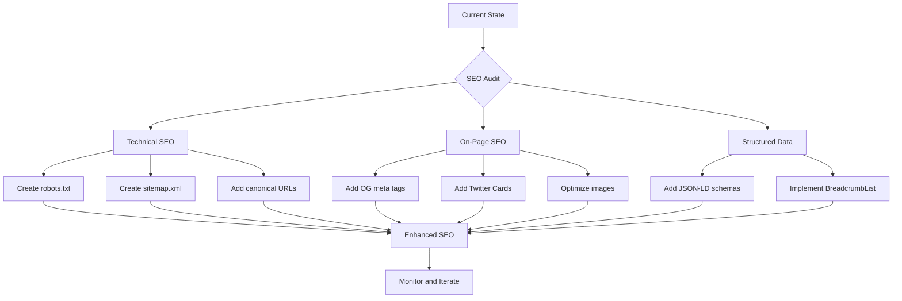

# Vanduo Framework - SEO Readiness Analysis

> **Note:** All recommendations in this document adhere to Vanduo's core philosophy: **No third-party libraries, no npm packages, no build tools.** Every SEO improvement involves only static files, native HTML tags, and inline JSON - pure HTML/CSS/JS.

## Executive Summary

The Vanduo Framework demonstrates **moderate SEO readiness** with solid foundational elements but lacks several critical SEO features. This analysis examines the framework's current state and provides actionable recommendations for improvement.

---

## Current SEO Status

### ✅ What's Working Well

#### 1. Basic Meta Tags
- **Present in [`index.html`](index.html:1-10)**:
  - `<meta charset="UTF-8">` - Character encoding
  - `<meta name="viewport">` - Mobile responsiveness
  - `<meta name="description">` - Page description
  - `<title>` tag - Page title

#### 2. Semantic HTML Structure
- Proper use of `<html lang="en">` for language declaration
- Semantic elements: `<nav>`, `<main>`, `<section>`, `<footer>`, `<article>`
- Heading hierarchy (h1-h6) properly implemented
- Breadcrumb navigation with proper markup

#### 3. Accessibility Features (Indirect SEO Benefit)
- Skip-to-content link for keyboard navigation
- ARIA labels on interactive elements:
  - `aria-label="Toggle navigation"` on navbar toggle
  - `aria-label="Breadcrumb"` on breadcrumb nav
  - `aria-label="Page navigation"` on pagination
  - `role="tablist"` on tab components
- `aria-current="page"` on active breadcrumb items
- `aria-expanded` states on collapsible elements

#### 4. Responsive Design
- Mobile-first CSS approach
- Responsive grid system (12-column)
- Viewport meta tag configured correctly

#### 5. Print Styles
- Dedicated [`css/utilities/print.css`](css/utilities/print.css:1) with:
  - Link URL display in print
  - Page break controls
  - Non-essential element hiding

#### 6. Performance Considerations
- No external dependencies (no jQuery, no Bootstrap)
- Modular CSS architecture (import only what you need)
- Local font files (no external font requests)

---

### ❌ What's Missing

#### 1. Critical SEO Files
| File | Status | Impact |
|------|--------|--------|
| `robots.txt` | ❌ Missing | Search engines can't understand crawl preferences |
| `sitemap.xml` | ❌ Missing | Search engines can't discover all pages efficiently |
| `favicon.ico` | ❌ Missing | Brand recognition in search results |
| `manifest.json` | ❌ Missing | PWA support and app-like search appearance |

#### 2. Open Graph & Social Meta Tags
Missing from [`index.html`](index.html:3-7):
```html
<!-- Open Graph (Facebook, LinkedIn) -->
<meta property="og:title" content="...">
<meta property="og:description" content="...">
<meta property="og:image" content="...">
<meta property="og:url" content="...">
<meta property="og:type" content="website">

<!-- Twitter Cards -->
<meta name="twitter:card" content="summary_large_image">
<meta name="twitter:title" content="...">
<meta name="twitter:description" content="...">
<meta name="twitter:image" content="...">
```

#### 3. Structured Data (JSON-LD)
No schema.org markup present. Recommended schemas:
- `SoftwareApplication` - For the framework itself
- `WebPage` - For documentation pages
- `BreadcrumbList` - For navigation hierarchy
- `Organization` - For brand information

#### 4. Canonical URL
Missing `<link rel="canonical">` tag to prevent duplicate content issues.

#### 5. Additional Meta Tags
Missing from head section:
```html
<meta name="author" content="...">
<meta name="keywords" content="CSS framework, HTML, JavaScript, ...">
<meta name="robots" content="index, follow">
<link rel="canonical" href="https://...">
```

#### 6. Image SEO
- No `alt` attributes on images (though the demo page has minimal images)
- No `loading="lazy"` attributes for performance
- No `<picture>` elements for responsive images

#### 7. URL Structure
- Current demo uses hash-based navigation (`#typography`, `#buttons`)
- No clean URL structure for multi-page documentation

---

## SEO Readiness Score

| Category | Score | Notes |
|----------|-------|-------|
| Technical SEO | 4/10 | Missing robots.txt, sitemap, canonical |
| On-Page SEO | 6/10 | Good meta description, missing OG tags |
| Semantic HTML | 8/10 | Excellent use of semantic elements |
| Accessibility | 7/10 | Good ARIA usage, room for improvement |
| Mobile SEO | 9/10 | Responsive design, viewport configured |
| Performance | 8/10 | No dependencies, modular architecture |
| **Overall** | **7/10** | Solid foundation, needs SEO enhancements |

---

## Recommendations by Priority

### High Priority (Immediate Impact)

1. **Create `robots.txt`**
   ```
   User-agent: *
   Allow: /
   Sitemap: https://yourdomain.com/sitemap.xml
   ```

2. **Add Open Graph meta tags** to [`index.html`](index.html:6)

3. **Add canonical URL** to prevent duplicate content

4. **Create favicon** and apple-touch-icon

### Medium Priority (Enhanced Visibility)

5. **Implement JSON-LD structured data** for:
   - Software/Framework schema
   - Breadcrumb schema
   - Organization schema

6. **Create `sitemap.xml`** (even for single-page, helps with indexing)

7. **Add Twitter Card meta tags**

### Low Priority (Polish)

8. **Add `loading="lazy"`** to images in documentation

9. **Consider multi-page documentation** with clean URLs

10. **Add `manifest.json`** for PWA support

---

## Implementation Checklist

```markdown
### SEO Files
- [ ] Create robots.txt
- [ ] Create sitemap.xml
- [ ] Add favicon.ico and apple-touch-icon
- [ ] Create manifest.json (optional)

### Meta Tags
- [ ] Add Open Graph tags (og:title, og:description, og:image, og:url, og:type)
- [ ] Add Twitter Card tags
- [ ] Add canonical URL
- [ ] Add author meta tag
- [ ] Add robots meta tag

### Structured Data
- [ ] Add JSON-LD for SoftwareApplication
- [ ] Add JSON-LD for BreadcrumbList
- [ ] Add JSON-LD for Organization

### Content Optimization
- [ ] Ensure all images have alt attributes
- [ ] Add loading="lazy" to below-fold images
- [ ] Review heading hierarchy for each page

### Technical
- [ ] Verify mobile-friendliness with Google's tool
- [ ] Test page speed with Lighthouse
- [ ] Validate HTML with W3C validator
```

---

## Mermaid Diagram: SEO Implementation Flow



---

## Conclusion

The Vanduo Framework has a **solid foundation for SEO** with proper semantic HTML, accessibility features, and responsive design. However, it lacks critical SEO infrastructure files and meta tags that modern search engines expect.

The recommended improvements are straightforward to implement and would significantly enhance the framework's discoverability and social sharing capabilities. Most changes involve adding files and meta tags rather than restructuring existing code.

**Next Steps:**
1. Review this analysis with stakeholders
2. Prioritize implementation based on project goals
3. Switch to Code mode to implement the high-priority items
